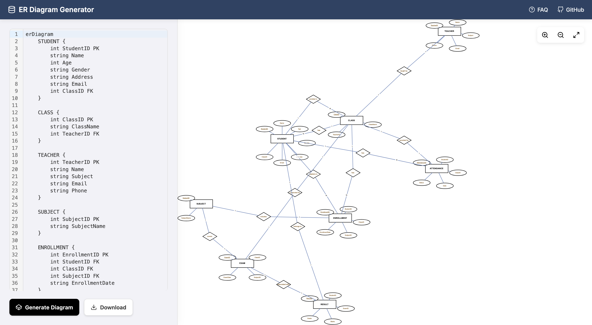

👉 [Try the Live Demo](https://er-diagram-generator.netlify.app/)

## Acknowledgements
- [mxGraph](https://github.com/jgraph/mxgraph) for the diagram rendering library 
- [Codemirror](https://codemirror.net/) for the code editor

## Description
It is designed to help students create the er diagram for their project documentation using mermaid syntax.

## Installation
```sh
npm install
npm run dev
```

